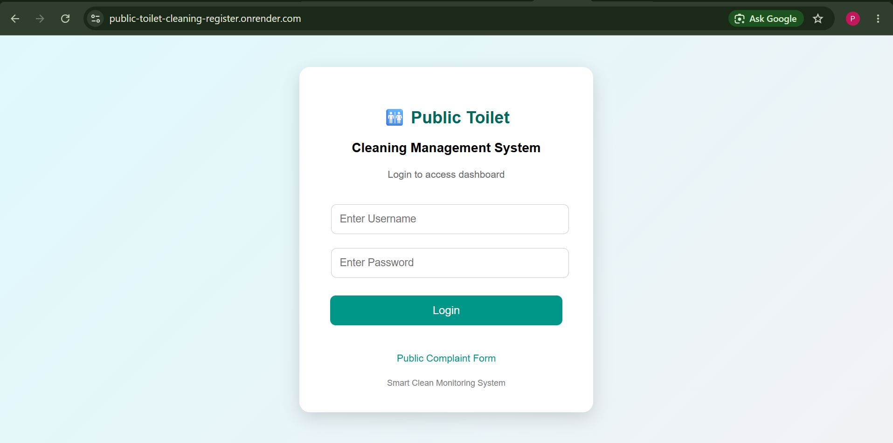
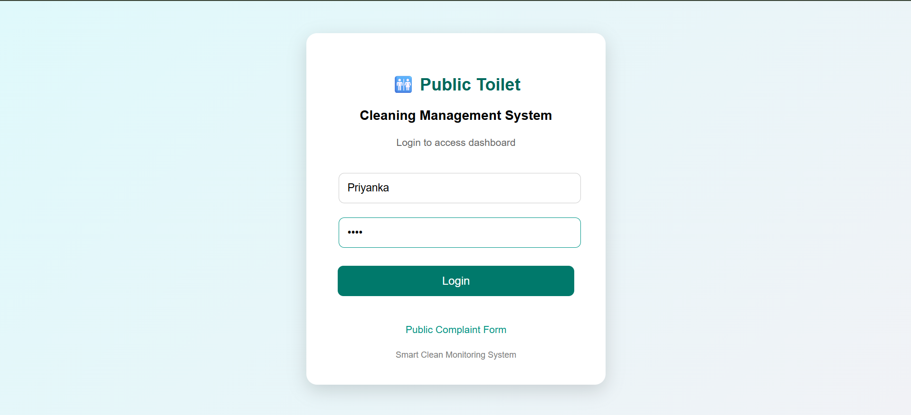
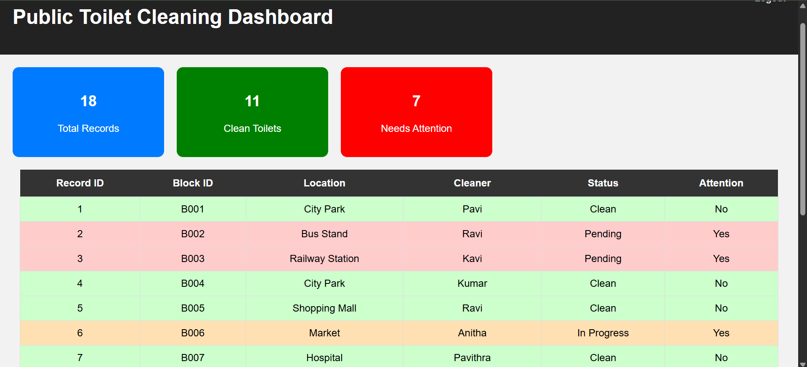
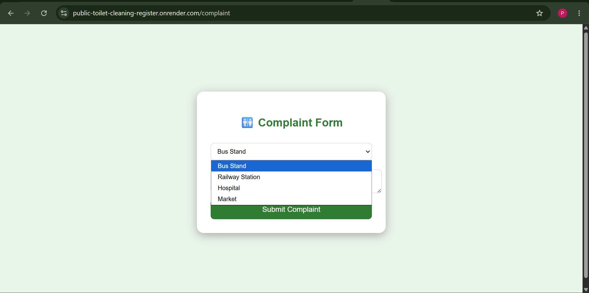
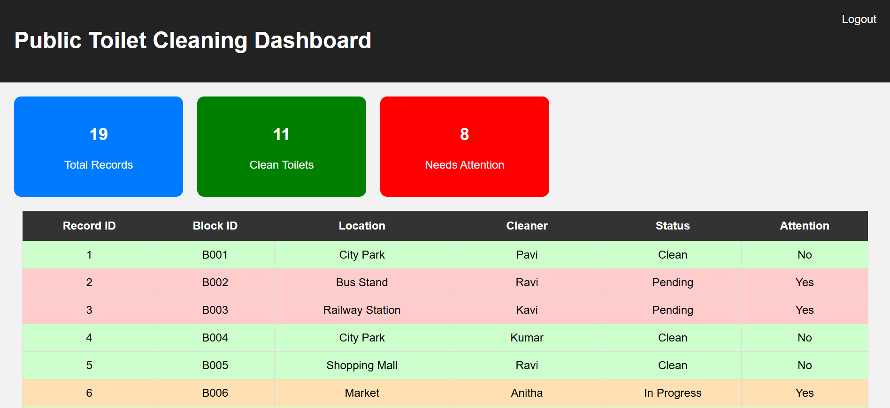

# 🚻 Public Toilet Cleaning Register and Complaint Management System

A Flask-based web application for managing public toilet cleaning records and user complaints.

## Features
- User Complaint Registration
- Dashboard with Live Records
- Total Records Count
- Clean Toilets Count
- Needs Attention Count
- Status-based Colour Indicators
- CSV Data Storage

## Technologies Used
- Python
- Flask
- HTML
- CSS
- Pandas

## Live Demo
https://public-toilet-cleaning-register.onrender.com/

## 🎥 Live Demo Video

Watch the project demonstration here:

https://drive.google.com/file/d/1Pzc3P44AiLGSWcE_v0f0X8oRNvXgKAoH/view?usp=sharing

## 📸 Screenshots











## Project Structure

```
app.py
requirements.txt
toilet_data.csv
templates/
static/
```

## Author

**Priyanka V**
